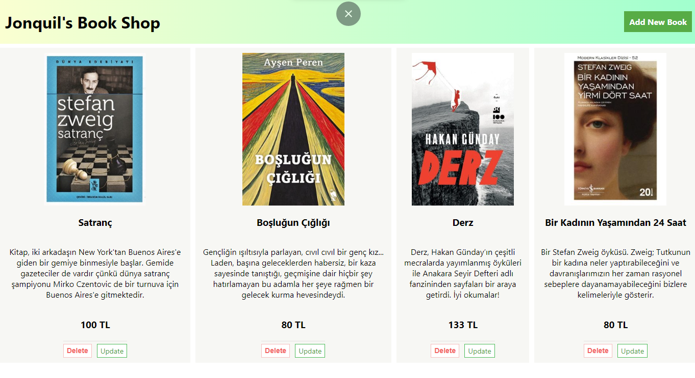

This is Jonquil's Book Shop application. It's a single-page website that lists books from MYSQL database. I've built this page using React and Express JS. It is a fully responsive website for mobile devices. You can see the source code of this page here on GitHub.

## 🛠 Use To Built

- React JS
- Node JS
- Express JS
- Mysql database
- Cypress JS
- Axios package

## 💻Project Features

- Listing all books
- Adding a new book
- Updating a book
- Deleting a book
  
## 💻 Test Results
-Test specs are designed using Cypress JS

